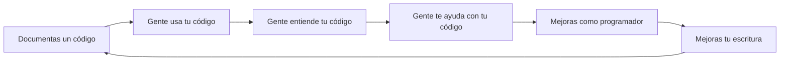

# Hello Mexicoders: Guía para tu primera documentación en Github

#### ¡Te damos la bienvenida a la 1ra edición de *Hello Mexicoders*!

Una parte muy importante de la programación es documentar tú código, ya que esta práctica trae muchos beneficios a corto y largo plazo [1].

En esta guía te enseñaremos lo necesario para que puedas documentar tus primeros códigos.

## Crea una cuenta en Github
- Entra a [Github](https://github.com/) 
- Da click en **Sign up**

- Crea una cuenta con tu correo, contraseña y elige un nombre de usuario. Este sera el nombre por el que te reconocerán.

## Crea tu primer repositorio
Una vez estemos dentro de Github:
- Da click en donde dice **New**

- Dale un nombre a tu repositorio
- Selecciona la casilla de **Add a README file**. El README es donde irá nuestra documentación.
- Da click en **Create Repository**

## Editar la documentación

Una 

## Referencias
[1] Write the Docs (2022, Marzo 30). A beginner's guide to writing documentation. Disponible en: https://www.writethedocs.org/guide/writing/beginners-guide-to-docs/
