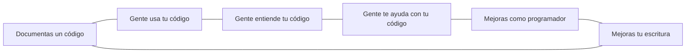

# Hello Mexicoders: Guía para tu primera documentación en Github

#### ¡Te damos la bienvenida a la 1ra edición de *Hello Mexicoders*!

Una parte muy importante de la programación es documentar tú código, ya que esta práctica trae muchos beneficios a corto y largo plazo

En esta guía te enseñaremos lo necesario para que puedas doc

## Referencias
[1] Write the Docs (2022, Marzo 30). A beginner's guide to writing documentation. Disponible en: https://www.writethedocs.org/guide/writing/beginners-guide-to-docs/
