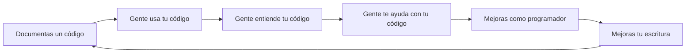

# Hello Mexicoders: Guía para tu primera documentación en Github

#### ¡Te damos la bienvenida a la 1ra edición de *Hello Mexicoders*!

Una parte muy importante de la programación es documentar tú código, ya que esta práctica trae muchos beneficios a corto y largo plazo [1].

En esta guía te enseñaremos lo necesario para que puedas documentar tus primeros códigos.

## ¿Qué es documentar?

Todos alguna vez nos hemos preguntado **¿por qué hice esto?** Ya sea en un dibujo, un paso en una receta de cocina, unos viejos apuntes o un código, la vida sería más fácil si se tuviera en algún lado la respuesta a la pregunta.
Eso es lo que busca la documentación, que escribas con palabras el **porqué** de lo que hayas hecho. Para qué sirve tu proyecto, cómo usarlo, todo lo que creas que le pueda ser útil a alguien en un futuro, incluyéndote, va en la documentación. 

## Guía para documentar

### Crea una cuenta en Github
- Entra a [Github](https://github.com/) 
- Da click en **Sign up**

- Crea una cuenta con tu correo, contraseña y elige un nombre de usuario. Este será el nombre por el que te reconocerán.

### Crea tu primer repositorio
Una vez estemos dentro de Github:
- Da click en donde dice **New**

- Dale un nombre a tu repositorio
- Selecciona la casilla de **Add a README file**. El README es donde irá nuestra documentación.
- Da click en **Create Repository**

### Editar la documentación

Una vez dentro del repositorio, verás que tienes un único archivo, README.md
Para editarlo, da click en el lápiz.

Se abrirá un procesador de texto en el cual podrás escribir tu documentación.
La documentación de Github se hace con una herramienta llamada Markdown cuyo funcionamiento y sintaxis podrás encontrar [aquí](https://markdown.es/)

Por último, describe tu código. No hay problema si al principio da miedo, pues como menciona en [1], *felicidades en tener miedo, eso significa que estás haciendo algo importante*. 

Ánimo y mucha suerte.

- El equipo de Hello Mexicoders

## Referencias
[1] Write the Docs (2022, Marzo 30). A beginner's guide to writing documentation. Disponible en: https://www.writethedocs.org/guide/writing/beginners-guide-to-docs/
